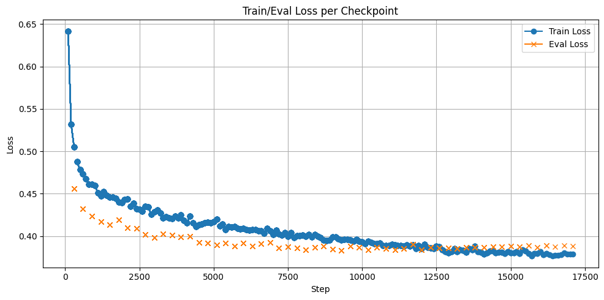

# 🧠🎙️ MaklowiczTTS – Neural Voice Cloning from YouTube Audio

This is an experimental text-to-speech (TTS) project based on audio extracted from YouTube videos published on the **RobertMakłowicz** channel. The goal is to train a custom voice model that emulates the speaker’s tone and delivery using neural speech synthesis.

This project is strictly for non-commercial, educational, and research purposes only. It is not intended to infringe on any rights, misrepresent, impersonate, or be used for any deceptive, malicious, or unethical purposes. Respect for the original content creator and intellectual property rights is paramount.

Despite a **large total dataset (~39h 23m 45s)**, the **linguistic diversity is limited** due to the thematic nature of the content (culinary travel, geography, and anecdotes). As a result, some words and phonetic combinations may be underrepresented in the training data.

---

## 🎯 Motivation

The decision to use this dataset was based on a few key factors:

- The videos contain **high-quality manually created subtitles** (not auto-generated), which is critical for aligning audio with text.
- The content is **spoken by a single consistent speaker**, simplifying speaker embedding and avoiding the need for diarization.
- The project was created **purely for research and educational purposes**.  
  It is **not intended to offend, imitate, or commercially exploit** the likeness of any individual.

This is my **first attempt at fine-tuning a TTS model**, and I wanted to experiment with real-world data that has a mix of clarity, emotion, and expressive speech.

---

## 🧪 Base Model & Tools

- Fine-tuned from: [`Sagicc/speecht5_finetuned_multilingual_librispeech_pl`](https://huggingface.co/Sagicc/speecht5_finetuned_multilingual_librispeech_pl)
- Base architecture: [`SpeechT5`](https://huggingface.co/microsoft/speecht5_tts) by Microsoft
- Speaker embeddings extracted using [`microsoft/speech-t5-tts`](https://huggingface.co/microsoft/speecht5_vc)
- ✅ Final fine-tuned model: [`VoidSamuraj/TTS_PL_Maklowicz`](https://huggingface.co/VoidSamuraj/TTS_PL_Maklowicz)

---

## 🏗️ Project Structure
- `urls.txt` – List of YouTube links, one link per line.
- `download.py` – Downloads YouTube videos and subtitles.
- `trim_audio_adn_update_sub.py` – Trims silence and aligns text with audio. *(optional – functionality might overlap with later steps)*
- `cleand_weird_digits.py` – Normalizes path names (prevents errors caused by strange directory/file names).
- `remove_noise.py` – *(optional)* Removes background noise.
- `copy_audio_and_subs_to_same_folder.py` – Organizes files for processing.
- `remove_empty_folders.py` – *(optional)* Cleans up orphaned folders.
- `cut_files.py` – Slices long audio files into model-friendly chunks.
- `clean_weird_digits.py` – Second pass cleanup for sliced text.
- `generate_csv_file.py` – Generates CSV metadata for training.

---

## 🚀 1. Preparing dataset

⚠️ You may need to adjust file paths or arguments in the notebook or scripts depending on your directory structure and model locations.

Follow these steps to prepare and train the model:


### 📥 1. Download raw audio and subtitles  
Start by fetching YouTube videos and manually-created subtitles.

```bash
python downloadnew.py
```

---

### ✂️ 2. Trim silence and update subtitles  
Removes non-speech audio and adjusts subtitle timestamps.  
*May be redundant if you're already slicing audio later (step 5).*

```bash
python trim_audio_adn_update_sub.py
```

---

### 🧹 3. Clean up filenames  
Fixes weird digits and characters in paths to avoid downstream errors.

```bash
python cleand_weird_digits.py
```

---

### 🔇 4. (Optional) Remove background noise  
In most cases, **noise removal worsened results** for clean audio – use with caution.

```bash
python remove_noise.py
```

#### 📁 4.1. (If noise was removed) Reorganize files  
Copies audio and subtitles into the same folder structure.

```bash
python copy_audio_and_subs_to_same_folder.py
```

#### 🗑️ 4.2. (If noise was removed) Clean up leftovers  
Removes empty folders left behind.

```bash
python remove_empty_folders.py
```

---

### 🔪 5. Cut long audio files into chunks  
Shorter clips are more suitable for training and augmentation.

```bash
python cut_files_new.py
```

---

### 🧽 6. (Optional) Run cleanup again  
If you're unsure whether the weird digit cleaner was used before, re-run it here.

```bash
python clean_weird_digits.py
```

---

### 📄 9. Generate CSV metadata  
Creates the dataset manifest required for training (id | audio_path | text).

```bash
python generate_csv_file.py
```


The CSV dataset should look like:

```csv
 id|audio_path|text
 001|audio/clip_001.wav|Dzień dobry.
 002|audio/clip_002.wav|To jest test.
 003|audio/clip_003.wav|Coś pysznego!
```
---
## 🚀 2. Training the Model

To train the model, run the fine-tuning script below. It uses the preprocessed data and speaker embeddings to adapt the model.
```
SpeechT5_TTS_Fine_tuning.ipynb
```
📉 Training Results


---

## 🗣️ 3. Generating Speech

Once the model is trained, you can generate audio samples and verify the results using the notebook:

```
generate_speech.ipynb
```
This notebook lets you:
- Load the fine-tuned TTS model
- Provide custom text inputs
- Generate speech using the learned voice
- Play or export the resulting audio
- Generate learning(loss) chart
- Filter audio

### 🎧 Example generated audio samples

You can listen to sample outputs generated by the fine-tuned model in the `audio_outputs/` directory. These files demonstrate the quality and style of the synthesized speech.

---

## 🧾 Notes & Limitations

- While the dataset is sizable, some vocabulary (e.g., technical terms, abstract nouns) is missing.
- This project was created as an **educational exercise**. It **does not attempt to replicate the real personality** behind the voice, nor does it aim for deepfake-level realism.
- Real-world datasets are messy — expect occasional misalignment, background noise, and inconsistency in prosody.

---

## 📜 [License](LICENSE)

All third-party materials (e.g., YouTube content) belong to their respective owners. This project, including the fine-tuned model based on Sagicc/speecht5_finetuned_multilingual_librispeech_pl, is distributed strictly for non-commercial research and educational purposes only under the Creative Commons Attribution-NonCommercial 4.0 International License (CC BY-NC 4.0).

No part of this project may be used for commercial purposes, monetized, or redistributed in any commercial context. Any likeness, content, or data derived from third-party sources remains the property of their respective owners and must not be exploited beyond fair, non-commercial use.
